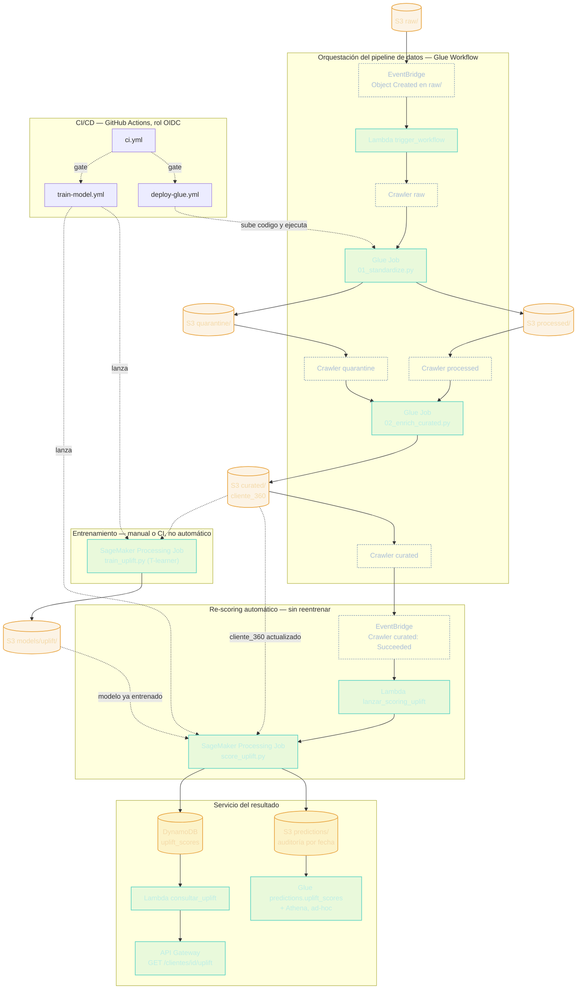
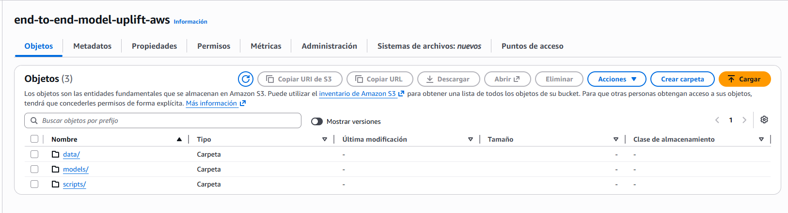
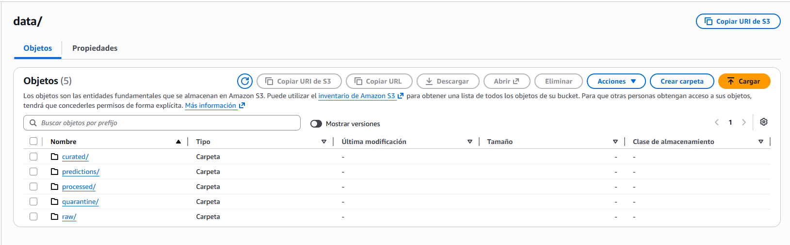
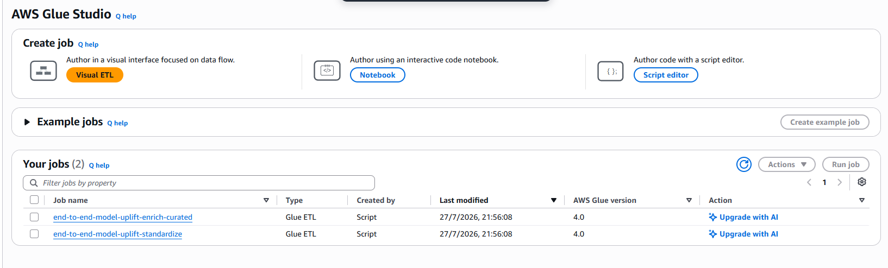
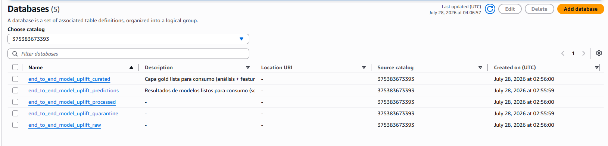
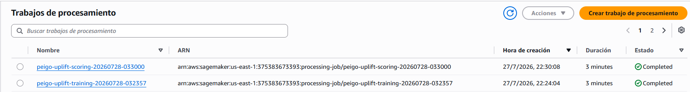
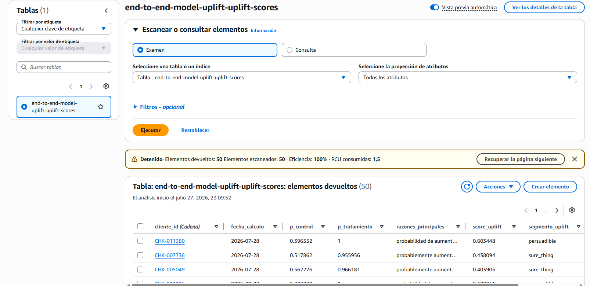
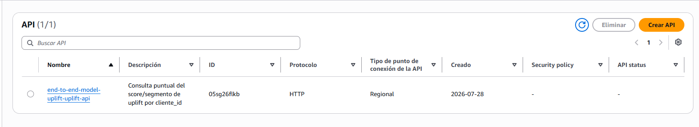
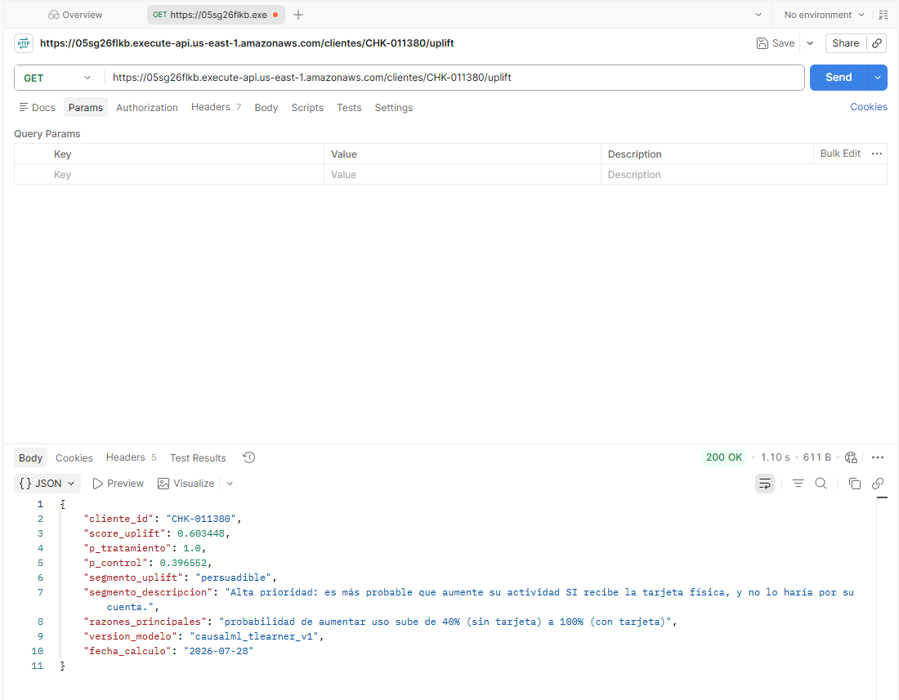

# Piloto de Tarjeta Débito Física — Pipeline end-to-end

## Resumen ejecutivo

**¿Cómo le fue al piloto?**

De 12,000 clientes activos en la base (tras limpieza), 5295 recibieron una tarjeta física, pero **solo el 47.8% la activó** (2529 de 5295), más de la mitad de las tarjetas entregadas nunca se usaron. Entre quienes sí activaron, el efecto es claro: comparando su propia actividad antes vs. después de activar la tarjeta, la **frecuencia mensual de transacciones subió +323% (0.88 → 3.71/mes)** y el **monto mensual subió +198% ($29 → $87/mes)**.

El análisis Diff-in-Diff contra un grupo de control, clientes que nunca recibieron tarjeta física, misma ventana de tiempo confirma que el tratado sube **+3.58 transacciones/mes más que el control** en el mismo período (p < 0.001), es decir, el efecto no se explica por una tendencia general del negocio. La hipótesis del piloto se sostiene con evidencia estadística, el problema no es que la tarjeta física no funcione, es que la mitad de las tarjetas entregadas nunca llegan a probarse.

**¿A quién priorizar en la siguiente ola?**

Antes incluso de recibir la tarjeta, los clientes que luego la activan ya muestran un patrón distinto, estadísticamente significativo pues Mann-Whitney p < 0.001, con 1.1 transacciones/mes vs. 0.9 para quienes se quedan solo con tarjeta virtual, y un gasto mensual de $36 vs. $29. Ese patrón pre-existente es predecible con datos que el banco ya tiene, sin necesidad de haber entregado la tarjeta primero. Si bien un modelo de propensión sería útil para responder si una persona utilizará o no su tarjeta física, como negocio se quiere priorizar también la ganacia, es decir se quiere identificar a las personas a las cuales entregarles una tarjeta física si cambie su comportamiento de consumo.

Por lo tanto se desarrolla el modelo uplift, se escoge esta metodología puesto que dado el contexto de negocio de que se tiene un presupuesto limitado para la siguiente ola, se quiere priorizar y encontrar a las personas que dado que les voy a dar una tarjeta física, cambie su comportamiento de consumo, es decir, se necesita identificar a clientes que necesiten un estímulo para que empiecen a consumir más y no se quiere gastar entregando tarjetas a quienes nunca cambiaran su comportamiento o a personas que de igual forma con o sin tarjeta seguiran aumentando su consumo e inclusive identificar a los clientes que por la insistencia de la contactabilidad deje de usarme.

De acuerdo con el modelo de uplift aplicado, se tiene la siguiente recomendación:

Tenemos que:

+ `persuadible`    : 2801 clientes (45.6%)
+ `seguros`     : 3261 clientes (53.0%)
+ `perdidos`     :    21 clientes (0.3%)
+ `perros dormidos`   :    65 clientes (1.1%)

1. **PRIORIZAR** "`persuadibles`" (2801 clientes, 45.6% de la siguiente ola candidata):

   Son los únicos donde la tarjeta física genera el cambio, el presupuesto limitado de tarjetas rinde más acá que en cualquier otro segmento. Esto es consistente con el ATE de +41.4%: la mayoría de ese efecto promedio viene de este grupo.
2. `Seguros` (3261 clientes, 53.0%):

   Aumentarían su actividad con o sin tarjeta, si sobra presupuesto después de cubrir a los persuadibles, se les puede dar la tarjeta (no perjudica), pero no es donde más rinde.
3. `Perdidos` (21 clientes, 0.3%):

   No vale la pena invertir tarjetas acá, ni con tarjeta cambiarían su comportamiento.
4. `Perros dormidos` (65 clientes, 1.1%):

   Evitar darles la tarjeta, el modelo estima que podría reducir su actividad respecto a dejarlos solo con virtual (posible reacción negativa a más fricción/gasto en el canal físico).

## Problemas de calidad encontrados

| Problema                                                                                                                                                                                     | Alcance                                                       | Cómo se resolvió                                                                                                                                                                                                                                                                                                                                                                                                                                                         |
| -------------------------------------------------------------------------------------------------------------------------------------------------------------------------------------------- | ------------------------------------------------------------- | -------------------------------------------------------------------------------------------------------------------------------------------------------------------------------------------------------------------------------------------------------------------------------------------------------------------------------------------------------------------------------------------------------------------------------------------------------------------------- |
| Texto sin estandarizar (mayúsculas/espacios/tildes) en`ciudad`, `canal_adquisicion`, `estado_cuenta`, `tipo` de tarjeta, `tipo_transaccion`, `campana`, `canal` de marketing  | Todas las tablas                                              | `normalizar_texto`/`normalizar_codigo`/`normalizar_nombre_propio` (trim + colapsar espacios + minúsculas + sin tildes, con snake_case para campos tipo código y Title Case para nombres propios)                                                                                                                                                                                                                                                                   |
| Booleanos con ~10 representaciones (`True/False/TRUE/1/0/S/N/Si/No/Sí/nan`)                                                                                                               | `es_devolucion`, `respondio`                              | `parsear_booleano`; el string literal `"nan"` se trata como valor faltante, no como `False`                                                                                                                                                                                                                                                                                                                                                                          |
| Fechas en 3 formatos mezclados (ISO,`DD/MM/YYYY`, epoch-ms)                                                                                                                                | Todas las columnas de fecha                                   | `parsear_fecha_multiformato`; el epoch-ms se detecta por "es todo dígitos" (no por cantidad fija de dígitos, porque fechas viejas tienen menos dígitos que fechas recientes)                                                                                                                                                                                                                                                                                          |
| **Bug real de timezone**: `to_date()` sobre epoch-ms usa el timezone local de la máquina que corre el job, no UTC                                                                   | Todas las fechas epoch-ms                                     | Se fija`spark.sql.session.timeZone=UTC` en `utils/spark_bootstrap.py` — sin esto, este pipeline corrido en Ecuador (UTC-5) da fechas un día distinto que el mismo pipeline corrido en un Glue Job en AWS. Verificado con test unitario.                                                                                                                                                                                                                              |
| Duplicados de PK exactos (`cliente_id` x48, `tarjeta_id` x49, `transaccion_id` x1,158 duplicados 2x)                                                                                   | clientes, tarjetas, transacciones                             | Verificado empíricamente que**todos** son fila repetida byte a byte (no hay conflictos de datos) → `dropDuplicates()`                                                                                                                                                                                                                                                                                                                                            |
| `cliente_id` huérfano (no existe en `clientes`)                                                                                                                                         | 248 en tarjetas, 1,544 en transacciones, 360 en marketing     | Enrutados a`quarantine/` con `motivo_descarte` — no se descartan en silencio                                                                                                                                                                                                                                                                                                                                                                                          |
| `monto` almacenado como string con prefijo `$` | transacciones | Cast a `decimal`/`double` tras quitar el `$`                                                                      |                                                               |                                                                                                                                                                                                                                                                                                                                                                                                                                                                            |
| `monto` negativo (~1% de las filas, **uniforme en los 8 tipos de transacción**, incluidos tipos de solo-entrada como `cash_in`/`p2p_in`/`remesa`)                             | 1,919 transacciones                                           | No es una convención de signo válida, si lo fuera, se concentraría en tipos de salida, es un defecto de captura → cuarentena, no`abs()`                                                                                                                                                                                                                                                                                                                              |
| `cedula` con formato inconsistente (10 dígitos plano vs. 11 caracteres con guion)                                                                                                         | clientes                                                      | `limpiar_cedula` deja solo dígitos; se documenta el supuesto de que ambos representan el mismo tipo de identificador                                                                                                                                                                                                                                                                                                                                                    |
| `fecha_nacimiento` inválida (ilegible, futura, o edad <18/>100)                                                                                                                           | ~720 clientes                                                 | Se pone a`null` + flag `fecha_nacimiento_valida=False`, la fila NO se descarta (el cliente sigue siendo válido para todo lo demás)                                                                                                                                                                                                                                                                                                                                   |
| `estado_codigo` de tarjetas (1/2/3) sin documentar por el banco                                                                                                                            | tarjetas                                                      | Se conserva crudo + columna`estado_codigo_hipotesis` marcada explícitamente como supuesto no verificado — la lógica de negocio real usa `fecha_activacion IS NOT NULL`, no este código ambiguo                                                                                                                                                                                                                                                                     |
| `comercio_codigo` no catalogado (`COM-998`/`COM-999`)                                                                                                                                  | 866 transacciones de compra                                   | Se mapea a categoría`otros_no_catalogado` en el enriquecimiento, no se pierde la transacción                                                                                                                                                                                                                                                                                                                                                                           |
| `catalogo_comercios`: nombre de comercio y categoría desalineados Ej. Netflix→"restaurante", Uber→"streaming"                                                                           | 15 de 42 filas (todos los comercios con nombre de marca real) | Se corrige a mano contra el nombre real del comercio, verificado en`notebooks/00_eda_exploratorio.py`, Ej. Netflix/Spotify→`streaming`, Uber/Cabify→`transporte`, CNT/Movistar/Claro→`telefonia` (categoría nueva, más precisa que el genérico `servicios_publicos`). Los 27 comercios genéricos (`Comercio 16`, `Comercio 17`, ...) **no se tocan** — no hay nombre real contra el cual validar su categoría, se mantiene la que ya traían. |
| **Fuga de información** en los features del modelo: usar actividad transaccional/de marketing posterior a que el cliente ya tuviera la tarjeta física para predecir si la activaría | features de`cliente_360`                                    | Todos los features usan actividad antes de`fecha_emision_fisica` no antes de la activación, ni el historial completo, es lo único que se sabría del cliente en el momento real de decidir si darle una tarjeta. `feat_n_categorias_comercio` pasó de 4.44 (con fuga) a 0.015 (correcto) tras el fix.                                                                                                                                                               |

## Flujo y arquitectura implementada

De un archivo nuevo en `raw/` a una predicción de uplift servida por API, sin intervención manual salvo para reentrenar el modelo. Todo de acuerdo con los recursos de `infra/*.tf`, orquestación 100% event-driven (EventBridge + Glue Workflow), sin Step Functions ni un scheduler propio.

## Evidencias

### S3
El S3 quedó  de manera similar a la estructura de este proyecto

### Glue

### Sagemaker

### DynamoDB

### API

